# Lugia's Signage
A signage UCP for BEEmod. Created (and abandoned) by GGuyX/Lugia and updated by Konclan.

Credits to Fajr(Fajr#6854) for Rocket Turret and Fizzler Signages.

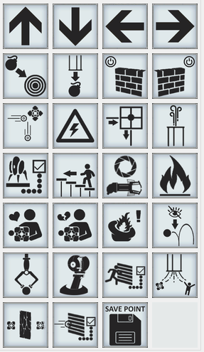
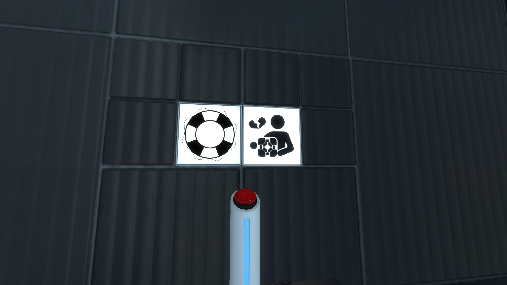

## Features:
* Directional Arrows Signage:

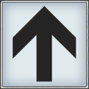

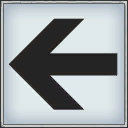
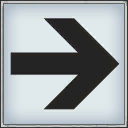

* Bomb Signage

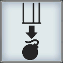
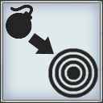

* Bumble Ball Signage

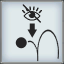

* Closed Solid Field Signage

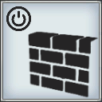
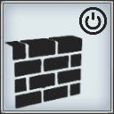

* Companion Cube Signage

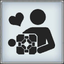
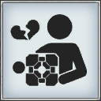

* Cube Deflector Signage

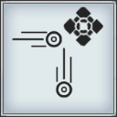

* Electricity Signage

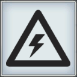

* Fire Signage

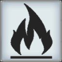

* Gravity Gun Signage

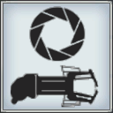

* Incinerator Signage

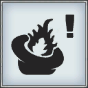

* Lifeform Sensor Signage

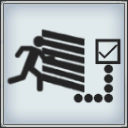

* Fizzler Signage

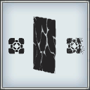

* Piston Stairs Signage

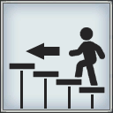

* Positronic Energy Orb Signage

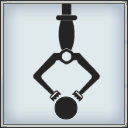

* Radiative Flux Rectangle Signage

* Rocket Turret Signage

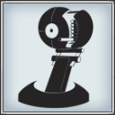

* Save Point Signage

* Turret Detector Signage

* Unstationary Scaffold Signage

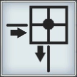

* Vactube Signage

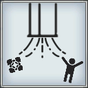

* Wind Tube Signage

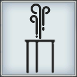
